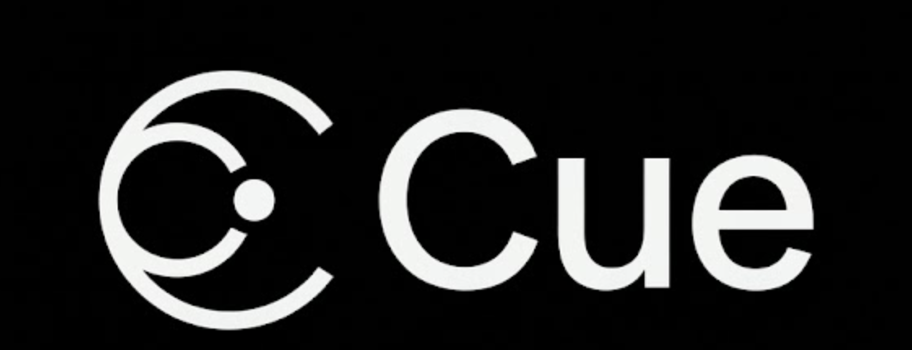
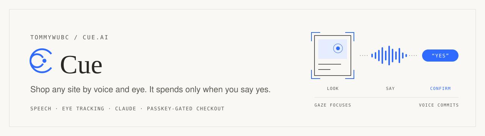
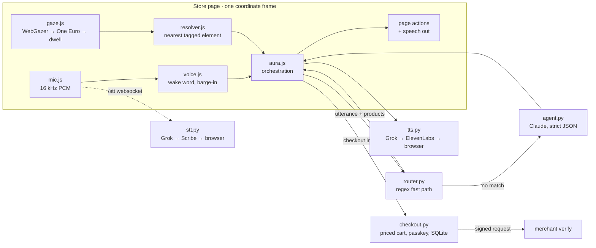

<p align="center">
  
</p>

<picture>
  <source media="(prefers-color-scheme: dark)" srcset=".github/assets/banner-dark.svg">
  
</picture>

<p>
  <a href="https://github.com/TommyWuBC/cue.ai/actions/workflows/ci.yml"></a>
  
  
  
  
</p>

**Cue** is a multimodal shopping assistant driven by speech and eye tracking. It
shops a real site for someone who cannot use a mouse. You talk; it reads the
page, answers from what is actually there, compares products side by side, and
works the controls. It buys on a real store only after you say yes to the
button that spends the money.

Eye tracking is built and currently switched off (`GAZE_MODE` in
`extension/background.js`) while the voice path is tuned. Nothing is numbered on
screen: you name what you mean.

[Quickstart](#quickstart) · [Using Cue](#using-cue) · [How it works](#how-it-works) · [Design principles](#design-principles) · [Signed requests](#signed-agent-requests) · [Status](#status-and-limits) · [Docs](#documentation)

<picture>
  <source media="(prefers-color-scheme: dark)" srcset=".github/assets/divider-dark.svg">
  
</picture>

## Quickstart

```bash
python3 -m venv .venv && .venv/bin/pip install -r server/requirements.txt
cp .env.example .env          # then paste your two keys in
.venv/bin/uvicorn main:app --app-dir server --port 4173 --reload
```

Open **http://localhost:4173** in Chrome (not the Claude preview pane, which
blocks camera and mic). Use `localhost` exactly: the passkey origin is
configured for it.

### Query parameters

| Parameter | Effect |
| --- | --- |
| `?gaze=mouse` | Drive with the mouse instead of the eyes (dev and demo fallback) |
| `?gaze=sim` | Mouse as truth plus synthetic gaze noise, through the real filter |
| `?sigma=110` | How noisy sim mode is, in px (default 70) |
| `?cal=0` | Skip calibration |

### Calibration

Calibration is thirteen points: look at each dot, then press SPACE, tap the dot,
or say “Cue, next”. Keep looking while the capture message is shown. Five more
points then measure accuracy without any input. If the camera cannot capture
your eyes, the current point shows a retry message. The accuracy figure is
printed to the console. Say “Cue, recalibrate” to start again. Selection is by
name in every case: numbered badges were removed after live sessions showed the
numbers drifting as the eyes moved.

### Experimental live-page extension

> [!NOTE]
> The extension is an experimental adapter. Page layouts can change, and a full
> passkey browser test on a live store has not been run.

1. Start the Cue server first (see above).
2. Run `python3 tools/build-extension.py`, then load `dist/cue-extension` as an
   unpacked extension in Chrome.
3. Open an H&M product page or Amazon search page, click the Cue toolbar icon,
   and select **Start on this page**. The panel checks that the backend is
   reachable before starting.

The adapter tags products from visible page markup and Product JSON-LD, then
loads the existing gaze and voice client in that tab's viewport. Video stays on
the device. Only product details and speech requests go to the local server. The
intended scope is shopping questions, scrolling, and focus; checkout stays on
Northfield. Reload the tab to stop the injected client. The build also writes a
Chrome Web Store upload ZIP; see [extension setup and deployment
notes](docs/EXTENSION.md).

## Configuration

All keys are optional, and everything degrades instead of dying. The model is
`claude-haiku-4-5-20251001`; override with `CUE_MODEL`.

| Key | Used for | Without it |
| --- | --- | --- |
| `ANTHROPIC_API_KEY` | Claude: every answer, and the product comparison | Offline answerer, simple commands only |
| `XAI_API_KEY` | Grok speech-to-text | Browser recogniser |
| `ELEVENLABS_API_KEY` | Spoken responses | Browser voice |

Check what is actually live: `curl localhost:4173/health`

## Using Cue

### Testing without a mic

```js
cue.say("is this wool")
cue.say("the third one")
cue.say("add the second one in medium")
cue.say("compare the airpods and the soundcore")
cue.say("check out")
cue.say("yes")
```

Same code path as speech. Only the wake word and STT are bypassed.

### Page control and product options

Say “Cue, the second one” to focus a product, then “Cue, medium, in black” to
set options. “Cue, add the second one in medium, in black” combines those steps.
A size is required before adding; no size is silently chosen.

For page control, say “Cue, scroll down” (then “faster”, or “stop”: “stop”
stops the scroll, “quit” ends Cue), “Cue, scroll to top”, “Cue, go back”, or
“Cue, no thanks” to close a popup such as the warranty upsell after an add.
Scrolling or resizing clears focus when its target leaves the viewport, so “add
it” cannot reuse an off-screen item.

### Comparing products

Say “Cue, compare the AirPods and the Soundcore”. Both product pages are read,
then one model call returns the rows, a verdict, which one to pick, and a line
about how it fits what you already own. The panel opens over the page you are
on, not in a new tab, because the microphone and the speech timers live in this
document and a background tab throttles them.

The line about what you own comes from this browser's own purchase journal. For
a demo, seed one with `window.cue.seedDemo()` in the console; it writes a single
purchase marked `DEMO-SEED`. Nothing seeds itself: invented history is
indistinguishable from a real order in the same journal.

Cue also remembers every product it has seen this visit, with its links, so
“open its reviews” still works after a search has replaced the page. That memory
stays in the tab and expires after an hour.

### Demo checkout

Add an item, say “Cue, check out”, and listen to the item, total, and remaining
budget. Set up a passkey once, then say “Cue, yes” and approve in the browser's
passkey prompt. A nearby phone may be offered by the browser. The merchant view
is at `http://localhost:4173/merchant.html`. Orders and the monthly budget are
stored in `server/data/cue.sqlite3` (ignored by git). The server sets prices from
`store/products.json`; cart prices sent by the browser are never accepted.

Say “Cue, cancel” at any point during checkout, including the readback or the
passkey prompt. Cancellation revokes the server intent and its approval
challenges, stops speech, and keeps the bag. If an order was already committed,
Cue reports that instead of claiming it was cancelled. A failed cancellation
can be retried from the dialog.

### Shopping insights

With Cue active, say “Cue, show me my analytics” to see searches, frequent
interests, confirmed demo-store additions, approved demo orders, and recent
activity. Say “close table” or another phrase containing “close” to return to
the store. The same view is available at `http://localhost:4173/analytics`.
Events stay in Chrome extension storage on live stores and in this browser's
site storage when using the demo store without the extension. The page can
download a CSV from that browser data; analytics does not call the Cue server.
On live stores, an add click is recorded as a request because the merchant cart
cannot be verified by Cue.

<picture>
  <source media="(prefers-color-scheme: dark)" srcset=".github/assets/divider-dark.svg">
  
</picture>

## How it works



Everything crosses one event bus (`client/bus.js`). Speech goes in through the
`/stt` websocket and out through `tts.py`; the deterministic router handles the
demo's core commands, and only what it cannot match reaches Claude.

<details>
<summary><b>Module map</b></summary>

| File | Role |
| --- | --- |
| `client/bus.js` | One event bus, everything crosses it |
| `client/gaze.js` | webgazer → outlier gate → One Euro → dwell → FOCUS |
| `client/mic.js` | mic → 16kHz PCM → `/stt` websocket → Grok |
| `client/resolver.js` | Gaze point → nearest tagged element |
| `client/voice.js` | Wake word, push-to-talk, barge-in, echo rejection, TTS playback |
| `client/aura.js` | Orchestration: utterance → server → speech + page actions |
| `client/avatar.js` | Cue's animated face; reacts to bus events, never emits any |
| `client/compare.js` | The side-by-side panel; `compare.css` styles it |
| `client/knowledge.js` | Every product seen this visit, with its links and facts |
| `client/speech.js` | Corrects misheard words against what is on the page |
| `store/index.html` | The Northfield storefront shell; views in `store/app/` (design notes: `store/DESIGN.md`) |
| `store/checkout.js` | Spoken order review + browser passkey ceremony |
| `server/checkout.py` | Server-priced cart, limits, passkey verification, SQLite orders |
| `server/router.py` | Regex fast path; the demo's core commands never hit an LLM |
| `server/agent.py` | Claude, one call, strict JSON out |
| `server/compare.py` | One call returns the rows, the verdict and the pick |
| `server/fallback.py` | Offline answerer over the product data (no key needed) |
| `server/tts.py` | Speech out: Grok, then ElevenLabs, then the browser voice (disk cache first) |
| `server/stt.py` | Speech in: Grok, then ElevenLabs Scribe, then the browser recogniser |

</details>

Markup contract and event shapes: see [ARCHITECTURE.md](./ARCHITECTURE.md).

## Design principles

**Gaze never selects; voice commits.** Gaze sets focus, speech confirms. This is
the accessibility story and it is also why a few cm of webgazer error is harmless.

**The model may shop; only you may commit.** It can search, compare, open pages,
scroll and add to a cart. The server strips `confirm`, `approve_checkout` and
`setup_passkey` from anything it proposes, and the page refuses them from any
source that is not the deterministic router, that is, from anything but your
own words. On a real store a control that actually charges (Buy now, Place your
order) is read back with its amount and pressed only after a separate spoken
yes. "Proceed to checkout" is not one of those: it spends nothing, so it just
goes.

**Only tagged elements are targetable.** `data-aura-product` / `data-aura-action`
(the `data-cue-*` spelling is also accepted). Six big hit targets on a page
beats pixel-accurate tracking.

**Everything in one coordinate frame.** Camera, mic, calibration and overlay all
run in the store page. Running webgazer from a separate extension page would put
its regression output in the wrong frame.

**Nothing spends money on one utterance.** Checkout only *stages* an order and
reads it back; a separate "yes" completes it. The budget is enforced at add time,
not at checkout.

**The demo degrades instead of dying.** No xAI key falls back to `fallback.py` and
the browser recogniser. No ElevenLabs credits falls back to the browser voice. No
camera falls back to `?gaze=mouse`. No mic falls back to `cue.say()`.

## Gaze tuning

The filter was swept against `?gaze=sim` over 6 noise seeds. At sigma=70:

| | Before | After |
| --- | --- | --- |
| Output noise sd | 70 px | **19 px** |
| Frame-to-frame jitter | 87 px | **10 px** |
| Worst single jump | 303 px | **46 px** |
| 400px saccade settles in | n/a | **260 ms** |

Constants live at the top of `client/gaze.js`. To re-sweep, open `?gaze=sim` and
import `oneEuro` from the module; the harness is three dozen lines.

> [!IMPORTANT]
> `dCutoff` must stay well **below** the noise frequency. If it drifts up, the
> speed estimate gets driven by the noise itself and `beta` re-opens the filter
> that was meant to close.

## Voice credits

Cue speaks with Grok, falls back to ElevenLabs, then to the browser voice.
Repeats are served from `server/cache/` and cost nothing. Before rehearsing:

```bash
.venv/bin/python server/prewarm.py
```

That generates the fixed demo lines once, with whichever voice is first in the
chain. `XAI_TTS_CHAR_BUDGET` and `ELEVEN_CHAR_BUDGET` hard-stop each provider.
Check spend and which provider is live: `curl localhost:4173/health`.

## Signed agent requests

Every checkout approval passes through Cue's server signer and a separate
merchant verification endpoint. The Ed25519 HTTP signature binds the request
method, merchant, path, query, content type, and body digest. The body includes
the stored order intent and the shopper's passkey assertion. The merchant
verifies both before recording an order; signing never replaces the passkey.

Requests expire after two minutes. Single-use nonces are stored in SQLite and
rejected on replay, including after server restarts. The merchant view shows
signature evidence and rejected-request counts. Existing orders without
signature evidence are labelled accordingly. The public key is available at
`/.well-known/cue-agent-keys.json`; the private key stays in the local database.

This implements a local agent-recognition profile based on
[Visa's TAP specification](https://developer.visa.com/capabilities/trusted-agent-protocol/trusted-agent-protocol-specifications)
and RFC 9421. The trust anchor is Cue's local key. Visa directory enrollment,
consumer recognition tokens, and payment containers are not configured.

## Status and limits

> [!WARNING]
> This is a **single shopper, localhost demo**. It has no account enrollment or
> merchant login and must not be deployed to the public internet as-is.

It records passkey-approved demo orders but does not charge a card. Stripe/Visa
sandbox payment remains to be built. See [the remaining work](docs/ROADMAP.md).

<picture>
  <source media="(prefers-color-scheme: dark)" srcset=".github/assets/divider-dark.svg">
  
</picture>

## Documentation

| Doc | Topic |
| --- | --- |
| [ARCHITECTURE.md](./ARCHITECTURE.md) | Event bus, markup contract, page ↔ server shapes |
| [docs/TECH_SPEC.md](./docs/TECH_SPEC.md) | Technical specification |
| [docs/DESIGN.md](./docs/DESIGN.md) · [store/DESIGN.md](./store/DESIGN.md) | Design notes for Cue and the Northfield storefront |
| [docs/EXTENSION.md](./docs/EXTENSION.md) | Chrome extension build, load and deployment |
| [docs/ROADMAP.md](./docs/ROADMAP.md) | Remaining work |
| [docs/PLAN.md](./docs/PLAN.md) · [docs/GUARDIAN_TODO.md](./docs/GUARDIAN_TODO.md) | Planned guardian-approval flow (not built) and its ordered work list |
| [CONTRIBUTING.md](./CONTRIBUTING.md) | Local setup and running the tests |

## License

[MIT](./LICENSE).
